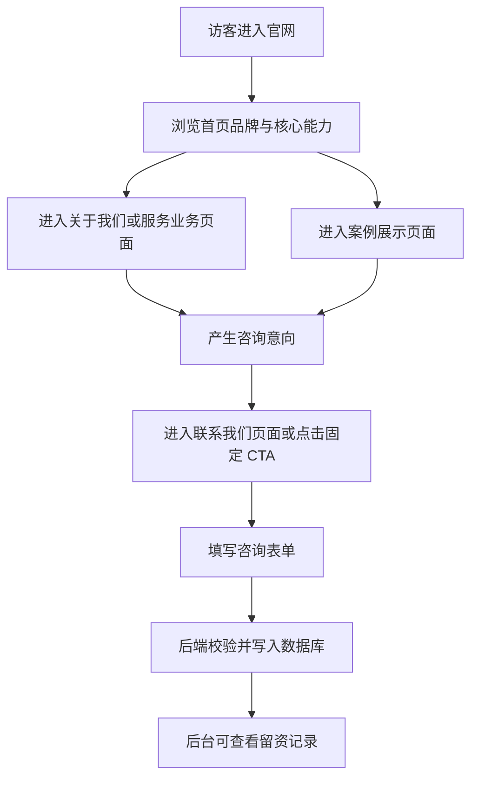
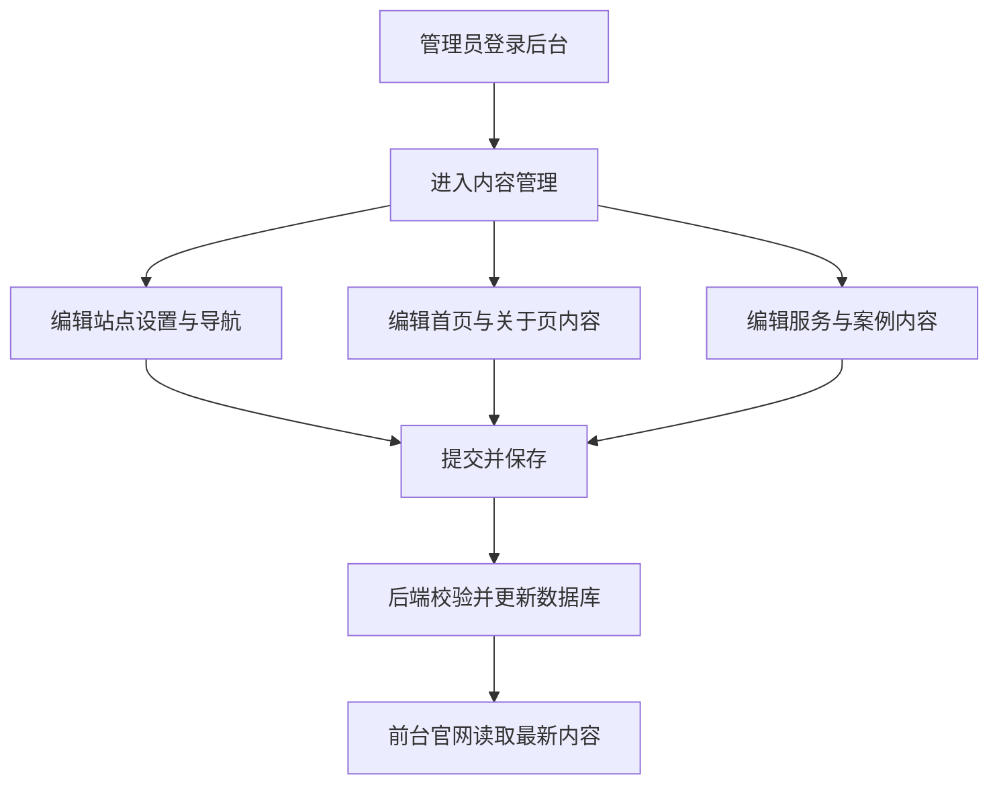

# 产品需求文档

## 1. 产品概述

`Drevortex 梦启新创` 官网重建项目用于替换旧的静态站点，建设一个具备高端企业官网视觉品质、真实数据链路、内容可维护、前后端分离清晰的全新官网系统。

- 核心目的：保留旧站视觉资产与版式记忆点，同时彻底解决旧站性能差、结构乱、假链路、不可维护的问题。
- 目标价值：打造可长期运营、可稳定扩展、可支持真实商业留资与案例管理的企业级官网。

## 1.1 呈现基线

- 旧站副本是公开页面的唯一呈现标准，新站必须做到打开效果大于等于旧站。
- 所有公开页面默认要求 1:1 高保真复刻，包括页面顺序、版块顺序、文案、卡片数量、视觉层级和关键动效节奏。
- 除非用户明确要求替换真实业务信息，否则旧站原文案、原占位信息、原分类和原统计表达都应先原样保留。
- 首期验收标准不是“像旧站”，而是“与旧站对比基本一致，并在性能和结构上更稳”。

## 2. 核心功能

### 2.1 用户角色

| 角色 | 进入方式 | 核心权限 |
|------|----------|----------|
| 公开访客 | 直接访问官网 | 浏览页面、筛选案例、提交咨询表单 |
| 管理员 | 后台登录 | 编辑站点内容、管理案例、查看留资、维护站点配置 |

### 2.2 功能模块

1. **首页**：品牌开场、核心 Hero、价值数字、业务展示、服务亮点、案例精选、咨询引导，全部按旧副本结构顺序复刻
2. **关于我们**：公司介绍、品牌理念、公司定位、核心优势，按旧副本内容区块 1:1 复刻
3. **服务业务**：核心业务分类、服务明细、服务流程，按旧副本卡片数量与顺序复刻
4. **案例展示**：案例列表、分类筛选、案例摘要，按旧副本 4 类筛选和 8 卡列表复刻
5. **联系我们**：联系方式、咨询表单、提交反馈，按旧副本双栏结构与字段顺序复刻
6. **后台内容管理**：站点配置、首页内容、关于页内容、服务内容、案例内容、留资查看

### 2.3 页面详情

| 页面名称 | 模块名称 | 功能描述 |
|----------|----------|----------|
| 首页 | 顶部导航 | 展示品牌、主导航、主题切换、滚动状态变化 |
| 首页 | 开场序列 | 还原旧站品牌揭示与电影感过渡，但用工程化方式重写 |
| 首页 | Hero 主区 | 展示品牌主标语、核心文案、主 CTA、视觉主场景 |
| 首页 | 价值数字桥接 | 展示关键数字、品牌价值与统计信息 |
| 首页 | 业务翻页展示 | 用高保真交互呈现核心业务能力 |
| 首页 | 服务亮点区 | 展示服务维度与企业优势 |
| 首页 | 案例精选 | 展示精选案例卡片并跳转至案例页 |
| 首页 | 固定咨询入口 | 在关键时机提供咨询 CTA |
| 关于我们 | Hero | 品牌介绍与页面导语 |
| 关于我们 | 公司介绍 | 公司定位与品牌阐释 |
| 关于我们 | 品牌理念 | 展示愿景、方法论、理念说明 |
| 关于我们 | 核心优势 | 以卡片形式展示优势 |
| 服务业务 | Hero | 页面导语与服务总览 |
| 服务业务 | 核心业务卡片 | 展示主要业务方向 |
| 服务业务 | 服务明细 | 展示各类服务能力与交付项 |
| 服务业务 | 服务流程 | 展示从需求到交付的流程 |
| 案例展示 | Hero | 页面导语与案例总览 |
| 案例展示 | 分类筛选 | 支持按分类切换案例 |
| 案例展示 | 案例列表 | 展示案例封面、摘要、分类、跳转入口 |
| 联系我们 | Hero | 页面导语与联系入口 |
| 联系我们 | 联系方式 | 展示电话、邮箱、地址、社交入口 |
| 联系我们 | 咨询表单 | 访客提交留资信息，由后端落库 |
| 后台 | 登录 | 管理员登录后台 |
| 后台 | 内容管理 | 维护公开页面文案、数字、案例、服务、导航等 |
| 后台 | 留资管理 | 查看、筛选、标记联系表单数据 |

## 3. 核心流程

### 3.1 访客主流程

访客进入首页，浏览品牌与业务能力，查看服务或案例信息，最终从首页或联系页提交咨询表单，数据由后端校验后写入数据库，并在后台可见。

### 3.2 管理员主流程

管理员登录后台，维护导航、首页文案、服务条目、案例数据与站点设置，更新后的内容通过 API 供前台官网渲染。

## 4. 用户界面设计

### 4.1 设计风格

- 主色：低饱和蓝色作为强调色，黑、深灰、白作为基础色
- 背景：深浅主题双模式，深色模式为主视觉基线
- 按钮：克制、锋利但不过度尖锐，圆角中小，强调悬浮反馈与光感
- 字体：中文与英文分别做品牌级搭配，不使用廉价感默认组合
- 布局：桌面优先、大留白、细边框、卡片化与精细分层共存
- 图形：几何线条、微光晕、网格、粒子、玻璃层、细噪点纹理
- 动效：强调节奏、场景转换与层级推进，避免页面全域同时乱动

### 4.2 页面设计概览

| 页面名称 | 模块名称 | UI 要求 |
|----------|----------|----------|
| 首页 | 开场序列 | 必须保留旧站黑场片头、光束、品牌揭示与退场节奏 |
| 首页 | Hero | 必须保留旧站主布局、标题层级、地球氛围、右侧理由区与滚动形变 |
| 首页 | 价值数字桥接 | 必须保留旧站原统计值、卡片数量和过渡位置 |
| 首页 | 业务翻页展示 | 必须保留旧站 3 屏顺序、文案、背景与翻页观感 |
| 首页 | 服务亮点区 | 必须保留旧站半圆服务轮盘与 5 项业务顺序 |
| 首页 | 案例精选 | 必须保留旧站精选案例数量、顺序与 CTA 节奏 |
| 关于我们 | 内容区 | 必须保留“认识仁励”、品牌理念、公司定位、核心优势等原始结构 |
| 服务业务 | 内容区 | 必须保留 5 项核心业务、5 条服务明细、5 步流程结构 |
| 案例展示 | 列表区 | 必须保留 4 类筛选按钮、8 张案例卡和对应分类 |
| 联系我们 | 表单区 | 必须保留旧站双栏排布、联系方式顺序与表单字段顺序 |
| 后台 | 管理界面 | 极简、紧凑、实用，不追求公开官网视觉风格 |

### 4.3 响应式策略

- 桌面优先
- 平板自适应
- 手机端保留核心信息结构，但允许对超重动效降级
- 对 `prefers-reduced-motion` 提供降级方案
- 移动端优先保证可读性、点击区域和表单可用性

## 5. 内容策略

- 旧站所有占位符、模板残留、伪案例必须在正式迁移前完成清洗。
- 首页统计数字、案例信息、联系方式等必须具备真实来源。
- 联系表单字段必须标准化，至少包含：姓名、手机号、公司/项目名称、需求说明。
- 页面 SEO 标题、描述、OG 信息由内容配置统一管理。

## 6. 非功能要求

### 6.1 性能

- 公开站点必须满足高端企业官网标准，首页允许有复杂动效，但不能牺牲核心加载表现。
- 所有图片必须做尺寸控制、格式优化与懒加载策略。

### 6.2 可维护性

- 所有页面内容必须可配置。
- 所有交互必须组件化与模块化。
- 页面布局、动效、数据读取、后台管理必须边界清晰。

### 6.3 安全性

- 公开接口必须做输入校验与限流。
- 管理后台必须鉴权。
- 后台接口必须做角色与会话校验。

## 7. 首期范围冻结

### 首期必须上线

- 5 个公开页面
- 1 套管理后台基础能力
- 联系表单真实提交流程
- 内容配置与案例管理
- SEO 基础能力

### 首期不纳入

- 国际化
- 在线客服系统深度集成
- 短信验证码服务
- 富文本页面编辑器

## 8. 产品验收结论

只要出现以下任一情况，即视为不达标：

- 页面布局与旧站主结构明显偏离
- 页面打开后的第一观感与旧副本明显不一致
- 首页动效观感被大幅削弱
- 联系表单仍是假链路
- 内容仍大量硬编码在模板中
- 没有后台管理内容能力
- 性能与 SEO 明显低于企业官网标准
