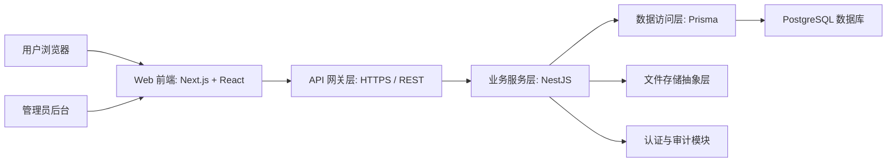
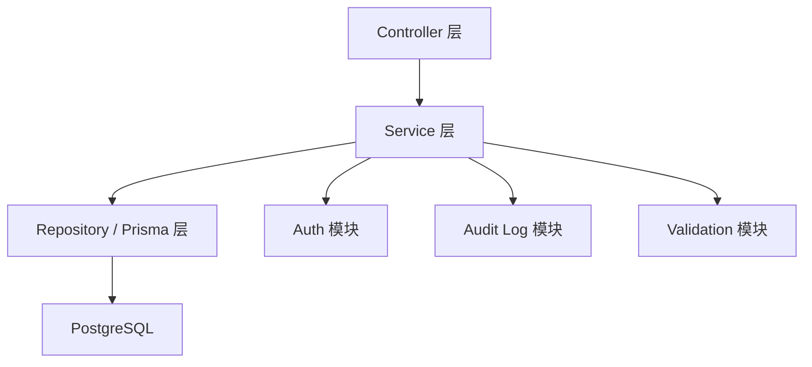
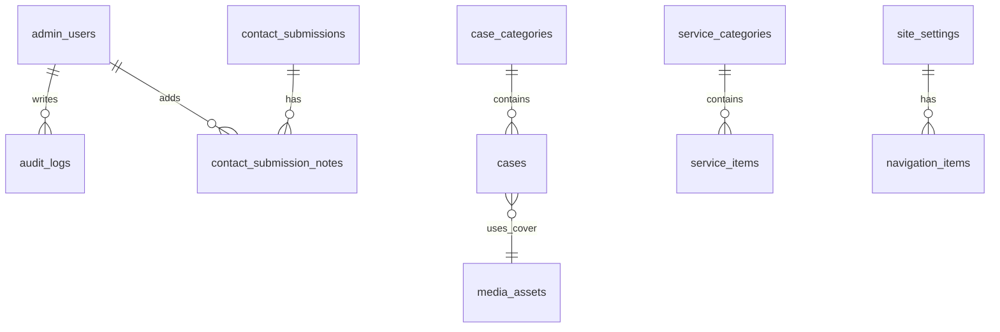

# 技术架构方案

## 1. 架构设计



### 架构说明

- `apps/web` 负责公开官网与后台界面渲染。
- `apps/api` 负责鉴权、内容管理、留资写入、后台接口。
- `PostgreSQL` 负责站点内容、案例、服务、留资、管理员与审计数据。
- 首期不依赖复杂外部服务，优先保证系统可控和可落地。

### 呈现约束

- 前端架构升级不能改变旧站副本的最终呈现结果。
- 所有公开页面必须先复刻旧站 HTML 结构层级、视觉层次和交互顺序，再进行组件化重构。
- “组件化”只代表实现方式升级，不代表允许重新设计页面编排。

## 2. 技术说明

- 前端：`Next.js 15 + React 19 + TypeScript`
- 样式：`Tailwind CSS 4 + CSS Modules + CSS Variables`
- 动画：`Motion + GSAP`
- 数据请求：`TanStack Query`
- 表单与校验：`React Hook Form + Zod`
- 状态管理：`Zustand`
- 后端：`NestJS 11 + TypeScript`
- 数据层：`Prisma`
- 数据库：`PostgreSQL 16`
- 鉴权：`JWT Access Token + Refresh Session + HttpOnly Cookie`
- 日志：结构化应用日志 + 管理员操作审计日志
- 包管理：`pnpm workspace`

## 3. 路由定义

| 路由 | 用途 |
|------|------|
| `/` | 官网首页 |
| `/about` | 关于我们 |
| `/services` | 服务业务 |
| `/cases` | 案例展示 |
| `/contact` | 联系我们 |
| `/admin/login` | 管理后台登录页 |
| `/admin/dashboard` | 管理后台首页 |
| `/admin/content/site-settings` | 站点配置管理 |
| `/admin/content/navigation` | 导航与页脚配置管理 |
| `/admin/content/home` | 首页内容管理 |
| `/admin/content/about` | 关于页内容管理 |
| `/admin/content/services` | 服务内容管理 |
| `/admin/content/cases` | 案例内容管理 |
| `/admin/leads` | 留资记录查看与状态管理 |
| `/admin/media` | 媒体资源管理 |

## 4. API 定义

### 4.1 公共读取接口

| 方法 | 路径 | 用途 |
|------|------|------|
| `GET` | `/api/public/site-config` | 获取站点公共配置 |
| `GET` | `/api/public/home` | 获取首页内容 |
| `GET` | `/api/public/about` | 获取关于页内容 |
| `GET` | `/api/public/services` | 获取服务页内容 |
| `GET` | `/api/public/cases` | 获取案例列表与分类 |
| `GET` | `/api/public/cases/:slug` | 获取案例详情 |

### 4.2 留资接口

| 方法 | 路径 | 用途 |
|------|------|------|
| `POST` | `/api/public/contact-submissions` | 提交联系表单 |

### 4.3 后台鉴权接口

| 方法 | 路径 | 用途 |
|------|------|------|
| `POST` | `/api/admin/auth/login` | 管理员登录 |
| `POST` | `/api/admin/auth/logout` | 管理员退出 |
| `GET` | `/api/admin/auth/me` | 获取当前管理员信息 |

### 4.4 后台内容管理接口

| 方法 | 路径 | 用途 |
|------|------|------|
| `GET` | `/api/admin/site-settings` | 获取站点设置 |
| `PUT` | `/api/admin/site-settings` | 更新站点设置 |
| `GET` | `/api/admin/navigation` | 获取导航配置 |
| `PUT` | `/api/admin/navigation` | 更新导航配置 |
| `GET` | `/api/admin/home-content` | 获取首页内容 |
| `PUT` | `/api/admin/home-content` | 更新首页内容 |
| `GET` | `/api/admin/about-content` | 获取关于页内容 |
| `PUT` | `/api/admin/about-content` | 更新关于页内容 |
| `GET` | `/api/admin/service-categories` | 获取服务分类 |
| `POST` | `/api/admin/service-categories` | 新建服务分类 |
| `PUT` | `/api/admin/service-categories/:id` | 更新服务分类 |
| `DELETE` | `/api/admin/service-categories/:id` | 删除服务分类 |
| `GET` | `/api/admin/service-items` | 获取服务条目 |
| `POST` | `/api/admin/service-items` | 新建服务条目 |
| `PUT` | `/api/admin/service-items/:id` | 更新服务条目 |
| `DELETE` | `/api/admin/service-items/:id` | 删除服务条目 |
| `GET` | `/api/admin/case-categories` | 获取案例分类 |
| `POST` | `/api/admin/case-categories` | 新建案例分类 |
| `PUT` | `/api/admin/case-categories/:id` | 更新案例分类 |
| `DELETE` | `/api/admin/case-categories/:id` | 删除案例分类 |
| `GET` | `/api/admin/cases` | 获取案例列表 |
| `POST` | `/api/admin/cases` | 新建案例 |
| `PUT` | `/api/admin/cases/:id` | 更新案例 |
| `DELETE` | `/api/admin/cases/:id` | 删除案例 |
| `GET` | `/api/admin/leads` | 获取留资记录 |
| `PATCH` | `/api/admin/leads/:id` | 更新留资状态 |

### 4.5 TypeScript 数据结构

```ts
export interface SiteConfig {
  siteName: string;
  siteNameEn: string;
  defaultTitle: string;
  defaultDescription: string;
  contactEmail: string;
  contactPhone: string;
  contactAddress: string;
  footerCopyright: string;
}

export interface HomeContent {
  heroTitleCn: string;
  heroTitleEn: string;
  heroSubtitle: string;
  heroCtaLabel: string;
  stats: Array<{
    label: string;
    value: string;
    sortOrder: number;
  }>;
}

export interface ContactSubmissionPayload {
  name: string;
  phone: string;
  company?: string;
  message: string;
  sourcePage: string;
}
```

## 5. 服务端架构图



### 模块划分

- `auth`
- `admin-users`
- `site-settings`
- `navigation`
- `home-content`
- `about-content`
- `service-categories`
- `service-items`
- `case-categories`
- `cases`
- `contact-submissions`
- `media-assets`
- `audit-logs`

## 6. 数据模型

### 6.1 ER 模型



### 6.2 核心表定义

#### `site_settings`

- 站点名
- 默认 SEO 标题
- 默认 SEO 描述
- 联系方式
- 页脚版权
- 主题默认值

#### `navigation_items`

- 导航标题
- 路径
- 排序
- 是否启用
- 所属区域（header/footer）

#### `home_sections`

- sectionKey
- 标题
- 副标题
- JSON 内容体
- 排序
- 是否启用

#### `service_categories`

- 名称
- slug
- 简述
- 排序
- 是否启用

#### `service_items`

- 分类 ID
- 名称
- slug
- 摘要
- 详细说明
- 图标键
- 排序
- 是否启用

#### `case_categories`

- 名称
- slug
- 排序
- 是否启用

#### `cases`

- 分类 ID
- 标题
- slug
- 摘要
- 封面图资源 ID
- 标签列表
- 服务范围
- 客户类型
- 展示顺序
- 是否精选
- 是否发布

#### `contact_submissions`

- 姓名
- 手机号
- 公司名称
- 需求说明
- 来源页面
- 处理状态
- 创建时间

#### `media_assets`

- 文件名
- 存储路径
- MIME 类型
- 宽高
- 文件大小
- 用途标记

#### `admin_users`

- 用户名
- 密码哈希
- 显示名
- 状态
- 最后登录时间

#### `audit_logs`

- 管理员 ID
- 动作
- 目标资源
- 目标 ID
- 请求摘要
- 创建时间

### 6.3 DDL 草案

```sql
CREATE TABLE admin_users (
  id UUID PRIMARY KEY,
  username VARCHAR(64) NOT NULL UNIQUE,
  password_hash VARCHAR(255) NOT NULL,
  display_name VARCHAR(100) NOT NULL,
  status VARCHAR(20) NOT NULL DEFAULT 'active',
  last_login_at TIMESTAMPTZ,
  created_at TIMESTAMPTZ NOT NULL DEFAULT NOW(),
  updated_at TIMESTAMPTZ NOT NULL DEFAULT NOW()
);

CREATE TABLE case_categories (
  id UUID PRIMARY KEY,
  name VARCHAR(80) NOT NULL,
  slug VARCHAR(120) NOT NULL UNIQUE,
  sort_order INT NOT NULL DEFAULT 0,
  is_enabled BOOLEAN NOT NULL DEFAULT TRUE,
  created_at TIMESTAMPTZ NOT NULL DEFAULT NOW(),
  updated_at TIMESTAMPTZ NOT NULL DEFAULT NOW()
);

CREATE TABLE cases (
  id UUID PRIMARY KEY,
  category_id UUID REFERENCES case_categories(id),
  title VARCHAR(160) NOT NULL,
  slug VARCHAR(200) NOT NULL UNIQUE,
  summary TEXT NOT NULL,
  cover_asset_id UUID,
  tags JSONB NOT NULL DEFAULT '[]'::jsonb,
  service_scope TEXT,
  client_type VARCHAR(100),
  sort_order INT NOT NULL DEFAULT 0,
  is_featured BOOLEAN NOT NULL DEFAULT FALSE,
  is_published BOOLEAN NOT NULL DEFAULT TRUE,
  created_at TIMESTAMPTZ NOT NULL DEFAULT NOW(),
  updated_at TIMESTAMPTZ NOT NULL DEFAULT NOW()
);

CREATE TABLE contact_submissions (
  id UUID PRIMARY KEY,
  name VARCHAR(80) NOT NULL,
  phone VARCHAR(20) NOT NULL,
  company VARCHAR(120),
  message TEXT NOT NULL,
  source_page VARCHAR(100) NOT NULL,
  status VARCHAR(20) NOT NULL DEFAULT 'new',
  created_at TIMESTAMPTZ NOT NULL DEFAULT NOW(),
  updated_at TIMESTAMPTZ NOT NULL DEFAULT NOW()
);

CREATE INDEX idx_cases_category_id ON cases(category_id);
CREATE INDEX idx_contact_submissions_status ON contact_submissions(status);
CREATE INDEX idx_contact_submissions_created_at ON contact_submissions(created_at DESC);
```

## 7. 前端实现约束

- 页面数据获取统一走 API 层，不允许页面直接写死业务内容。
- 首页复杂动效拆成独立 hooks 与 animation controller，不允许单文件巨型脚本。
- 子页共用布局组件、主题系统、滚动显隐系统。
- 所有图片组件统一封装，支持尺寸、懒加载、占位和 SEO 属性。
- 旧站的片头、Hero 形变、Flip 三屏、服务轮盘、筛选案例和联系页双栏表单都必须做逐模块复刻。
- 在没有达到旧副本 1:1 呈现前，不允许为了“更现代”而修改旧站布局和文案结构。

## 8. 安全与运维

### 8.1 安全要求

- 管理后台所有接口必须鉴权。
- 所有输入参数用 `Zod` 或 DTO 校验。
- 联系表单增加频率限制、服务端防刷与日志记录。
- 上传文件做类型、后缀、大小校验。

### 8.2 部署建议

- `web` 与 `api` 分别容器化部署。
- Nginx 统一反代与 HTTPS 终止。
- PostgreSQL 独立实例。
- 环境分为 `development / staging / production`。

## 9. 技术结论

本架构既满足用户要求的 React 前端，也满足企业级官网必须具备的后端与数据库能力。

并且它明确支持后续两件事：

1. 在不破坏首页视觉表现的前提下重写高复杂动效。
2. 在不返工前端结构的前提下持续增加后台内容管理能力。
